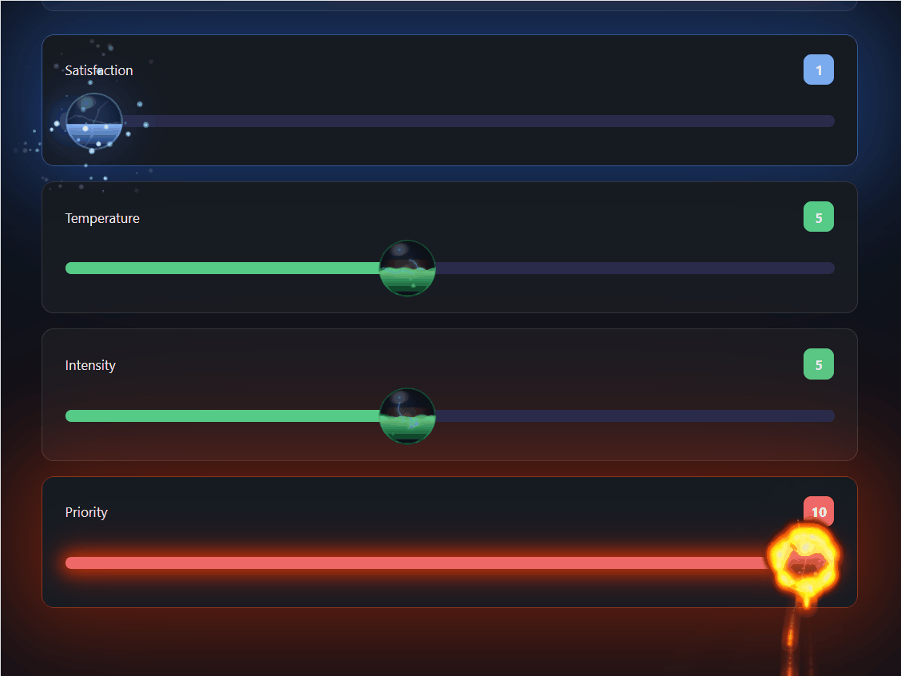
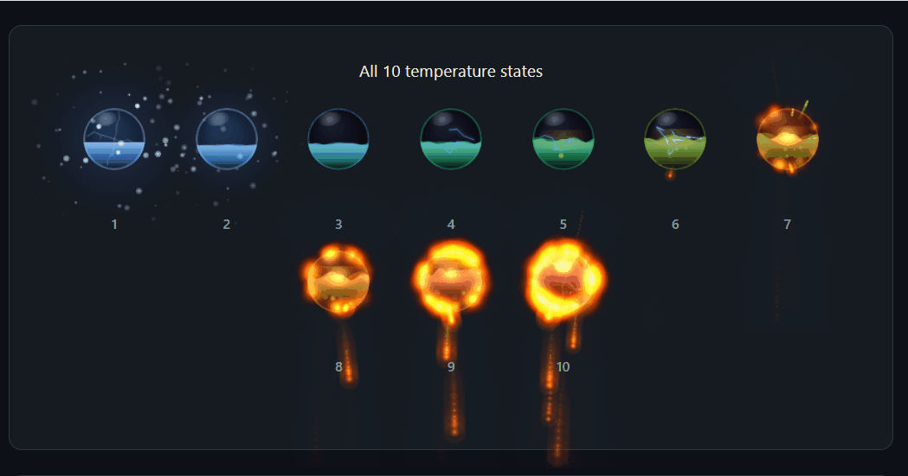
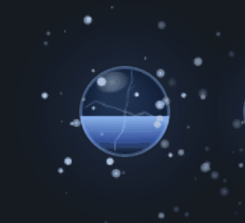
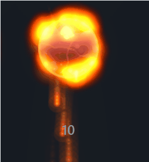
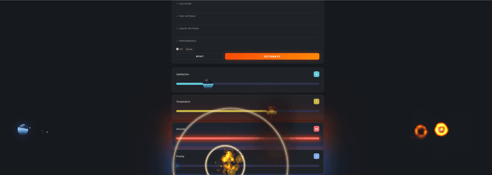
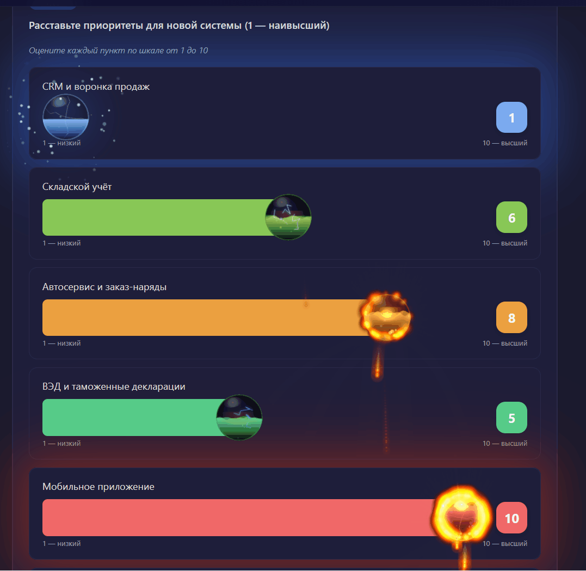

# lava-orb

**Температурно-реактивный жидкий шар, привязанный к `<input type="range">`.**
Canvas 2D · zero dependencies · MIT



На минимуме значения — лёд и снег. На максимуме — огонь, молнии, взрывы. Между ними — плавный градиент цвета и вязкости жидкости. Работает как drop-in-замена стандартного ползунка: орб движется вместе с thumb, столкновения между орбами одной группы просчитываются, поведение настраивается через мощный TUNE-объект.

---

## Зачем

Стандартные ползунки — скучные. Цифра "7" ничего не говорит о том, насколько "жарко" респонденту по этому вопросу. `lava-orb` превращает ввод числа в визуальный сигнал: ты **видишь**, что выбрано больше, а не считаешь деления на шкале.

Подходит для:

- **Опросников и анкет** — приоритезация задач, оценка интереса, NPS
- **Настроечных панелей** — любой слайдер, где важна "температура" значения
- **Демо и арт-проектов** — готовая физика жидкости, огня, льда

---

## Возможности

- 🌊 **Жидкая симуляция** — волны на поверхности, гравитация при наклоне, инерция при броске
- 🔥 **Два движка огня** — particle-based (реалистичные искры) и DOOM-fire (ретро-клеточный автомат)
- ❄️ **Эффекты холода** — иней, падающий снег, ледяные частицы
- ⚡ **Молнии** на максимуме значения
- 💥 **Кинематографичные взрывы** — файрболы, ударная волна, bloom, дрожание экрана
- 🧲 **Detach & throw** — резким броском слайдера орб отрывается, летит по физике и возвращается
- 👥 **Группы орбов** — орбы из одной группы сталкиваются между собой
- 🎨 **10-уровневые палитры** — от холодного голубого к горячему красному
- 🧩 **Модульные mixin'ы** — подключай только нужные эффекты
- 🪶 **Zero dependencies** — ни React, ни Vue, ни jQuery. Чистый ванильный JS.

---

## Установка

### npm

```bash
npm install lava-orb
```

```js
import { attach } from 'lava-orb';

const slider = document.querySelector('input[type=range]');
const handle = attach(slider, { size: 60 });
```

### CDN / `<script>`

```html
<script src="https://unpkg.com/lava-orb/dist/lava-orb.js"></script>
<script>
  const handle = LavaOrb.attach(document.getElementById('mySlider'));
</script>
```

### Локально без сборщика

Скачай `dist/lava-orb.js` (~106 KB) и подключи через `<script>`. Никаких build-шагов.

---

## Quick start

```html
<input type="range" id="q1" min="1" max="10" value="5" />

<script src="https://unpkg.com/lava-orb/dist/lava-orb.js"></script>
<script>
  LavaOrb.attach(document.getElementById('q1'), {
    size: 60,        // диаметр орба в пикселях
    detach: true,    // разрешить отрыв при резком броске
    onChange: v => console.log('значение:', v)
  });
</script>
```

Готово. Вокруг ползунка появится обёртка, на неё ляжет орб, который движется вместе с thumb и меняет цвет/эффекты от 1 до 10.

---

## Галерея эффектов

| | |
|---|---|
|  | **Смена палитры 1 → 10.** От ледяного голубого через зелёный к огненно-красному. |
|  | **Лёд (val 1-2).** Иней на орбе, падающий снег, ледяные частицы на отрыве. |
|  | **Огонь (val 9-10).** Particle-based с искрами, дымом и wrap-around через `mix-blend-mode: screen`. |
|  | **Detach.** Бросок слайдера > 25% за 150 мс → орб отрывается, летит, возвращается к thumb. |
|  | **Explosion.** `handle.explode()` — файрболы, ударная волна, shake-камера. |
|  | **Группы.** Орбы из одной группы сталкиваются между собой в общем rAF-цикле. |

---

## API

### `LavaOrb.attach(input, options) → handle`

Привязывает орб к существующему `<input type="range">`.

**Options:**

| Параметр | Тип | По умолчанию | Описание |
|---|---|---|---|
| `size` | number | `60` | Диаметр орба в пикселях |
| `group` | OrbGroup | `default` | Группа для столкновений |
| `palette` | string \| function | `'default'` | Имя палитры или `(val, isDark) => [c1, c2, c3, c4]` |
| `detach` | boolean | `true` | Разрешить отрыв при резком броске |
| `onChange` | function | — | Колбэк `(value) => void` на каждом изменении |
| `fire` | object | — | Настройки огня (intensity, style, …) |
| `liquid` | object | — | Настройки жидкости (surface, gravity, …) |
| `tune` | object | — | Полный TUNE-объект с низкоуровневыми параметрами |

**Handle (возвращаемый объект):**

```js
handle.setVal(v)         // задать значение (1-10)
handle.setColors(pal)    // задать палитру вручную
handle.setFireStyle(s)   // 'particles' | 'doom'
handle.explode()         // взорвать орб 💥
handle.isAlive()         // жив ли handle
handle.destroy()         // удалить орб, снять listeners

handle.orb               // прямой доступ к экземпляру LavaOrb
handle.input             // ссылка на исходный input
handle.wrapper           // DOM-обёртка
```

### `LavaOrb.createGroup(opts) → OrbGroup`

Создать изолированную группу. Орбы в разных группах не сталкиваются.

```js
const groupA = LavaOrb.createGroup({ name: 'survey-A' });
LavaOrb.attach(input1, { group: groupA });
LavaOrb.attach(input2, { group: groupA });
```

### `LavaOrb.getByInput(input) → handle | null`

Вернуть handle, ранее привязанный к `input`. `null` если не привязан или уже уничтожен.

---

## Разработка

```bash
# Запустить локальный сервер (Python 3)
python -m http.server 8877

# Открыть главное демо
# → http://localhost:8877/examples/03-full.html

# Пересобрать IIFE-бандл после правок в src/
node build.cjs

# Тесты (19 шт.)
# → http://localhost:8877/tests/runner.html
```

Структура:

```
src/
├── core/       # палитры, TUNE-параметры, helpers
├── orb/        # класс LavaOrb + mixin'ы (fire, frost, particles)
├── fx/         # детач и взрыв — отдельные модули
├── public/     # attach(), OrbGroup — публичный API
└── index.js    # default export + window.LavaOrb
```

`build.cjs` склеивает `src/` в один IIFE-бандл (`dist/lava-orb.js`). Никакого rollup/webpack/tsup — собственный простой bundler в ~150 строк.

---

## Связанные инструменты

Орб создавался с помощью двух отдельных редакторов — они тоже open source:

- [**liquid-orb-editor**](http://192.168.1.130:3000/androman/liquid-orb-editor) — тонкая настройка жидкости (волны, гравитация, вязкость, сплэши)
- [**fire-particle-editor**](http://192.168.1.130:3000/androman/fire-particle-editor) — ручная лепка пламени (искры, дым, конус, трейлы)

---

## Лицензия

[MIT](LICENSE) © 2026 andromanpro

---

## English

> **Temperature-reactive liquid orb attached to HTML range inputs.** Canvas 2D · zero deps · MIT.

### Install

```bash
npm install lava-orb
```

```js
import { attach } from 'lava-orb';
attach(document.querySelector('input[type=range]'), { size: 60 });
```

### Or via CDN

```html
<script src="https://unpkg.com/lava-orb/dist/lava-orb.js"></script>
<script>LavaOrb.attach(document.getElementById('slider'));</script>
```

### Features

- Liquid physics (waves, gravity, inertia)
- Two fire engines: particle-based + DOOM-fire cellular automaton
- Frost & snow effects on low values
- Electric arcs on max
- Cinematic explosions (`handle.explode()`)
- Detach physics (throw the orb via fast slider drag)
- Orb groups with inter-orb collisions
- 10-step palette (`cold → hot`)
- ~106 KB IIFE bundle, zero dependencies

Full API reference and examples — see Russian section above or the [`examples/`](examples/) folder.
